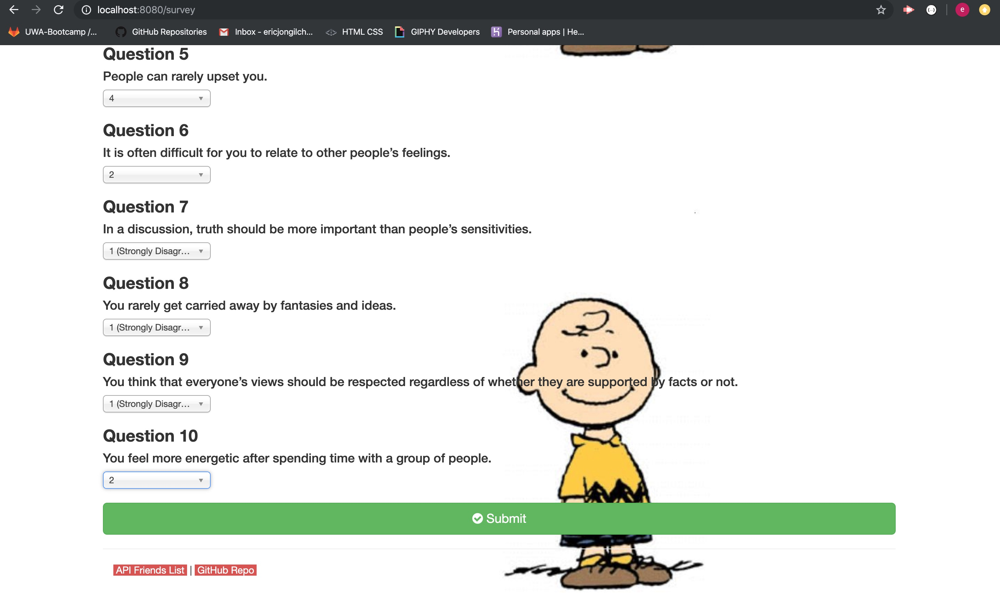
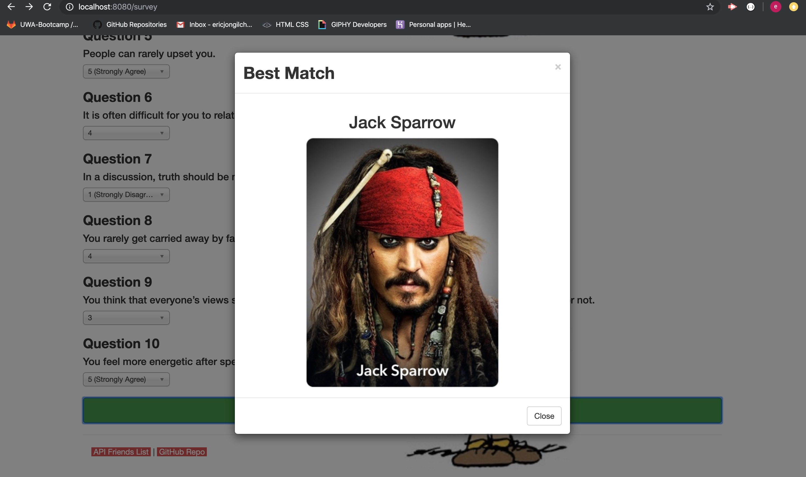

# Friend Finder

### A compatibility finding server app using Node.js, Express.js and Ajax deployed on Heroku.

## Current progress
* Completed
  * GitHub repository
  * .gitignore file 
  * file directories
  * data file
  * npm init
  * npm installation packages
  * html routing and api routing
  * `main.html` and `survey.html` codes are modified after _directly_ copied from the app demo link provided from class material repository.
  * logics for finding the most compatible friend by calculating the sum of differences for each answer choices for all questions.
  * display the best friend suggestion on modal
  * deployed to Heroku
  * solved Heroku build and deploy issues
  * update and display API Friends List with added user input at the end of the data array of objects
  * forwarding to GitHub Repository
  * app running screenshots included
  * display best matching friend picture on modal

* Further development
  * using `Least Square Regression Line` method to achieve more accurate calculation to find better matching friend

* App running screenshots

Figure 1. `main.html` of Friend Finder app running on Heroku. Click on `Go to Survey` will lead to `survey.html`. Click on `API Friends List` will route `/api/friends` and displays friends list array of objects. Click `GitHub Repo` will lead to FriendFinder repository on GitHub.

Figure 2. `/api/friends` route displays the current friends list.

Figure 3. `survey.html` captures user inputs which representing user's characteristics. All inputs and questions fields are required and will be validated when user submit the survey. Figure shows name, picture input and questions 1 through 4.

Figure 4. `survey.html`. Figure shows questions 5 through 10.

Figure 5. `survey.html`. Upon clicking `Submit` button, modal pops up displaying the best matching or compatible friend suggestion as a result.

Figure 6. `/api/friends` route displays the updated friends list. The user named `testing` and user's answer choies are added at the end of friends list data array of objects.

Figure 7. `survey.html`. Validation alert pops up when the survey submitted with unanswered required field.

* [Run app on Heroku](https://infinite-fortress-35051.herokuapp.com/)